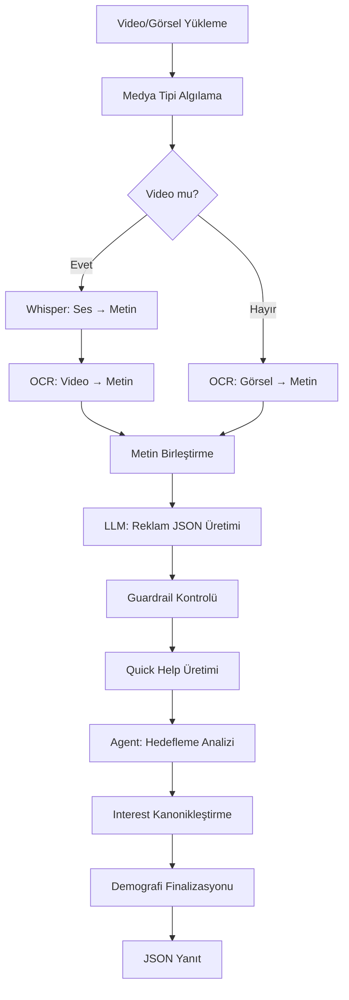

# 🚀 JetAds AI - Universal Ad Engine

<p align="center">
  
  
  
  
</p>

## 📖 Genel Bakış

**JetAds AI**, yapay zeka destekli, çok platformlu reklam yönetim ve optimizasyon sistemidir. Sistem, video ve görsellerden otomatik metin çıkarımı yaparak, LLM (Large Language Model) kullanarak optimize edilmiş reklam içeriği üretir ve çoklu reklam platformlarında kampanya oluşturma, yönetme ve optimizasyon süreçlerini otomatikleştirir.

### 🎯 Temel Özellikler

- 🤖 **AI Destekli İçerik Üretimi**: Video/görselden otomatik metin çıkarımı (Whisper + OCR) ve LLM ile reklam içeriği üretimi
- 🎯 **Akıllı Hedefleme**: Çoklu sinyal kaynağı ile demografi analizi ve interest kanonikleştirme
- 📱 **Çoklu Platform Desteği**: Meta (Facebook/Instagram), TikTok, LinkedIn, Google Ads, YouTube
- 🎬 **Video AI Servisleri**: Otomatik kesim, subtitle, gürültü azaltma, duygu bazlı düzenleme, B-roll üretimi
- 🔍 **Zero-Hardcode Interest Retrieval**: Tamamen veri odaklı, hardcode içermeyen interest bulma sistemi
- 📊 **Performans Optimizasyonu**: Thompson Sampling bandit ile öğrenen optimizasyon sistemi
- 🌍 **Çok Dilli Destek**: Türkçe ve İngilizce desteği, otomatik dil algılama

---

## 🏗️ Proje Mimarisi

### Dizin Yapısı

```
Advert_Project_docker/
├── backend/                          # Ana backend servisi
│   ├── main.py                      # FastAPI ana uygulama (Reklam üretimi)
│   ├── extract_video_text.py        # Video/görsel metin çıkarımı
│   ├── merge/                       # Platform entegrasyonları
│   │   ├── core/                    # Temel modüller (LLM, agent, scoring)
│   │   └── providers/               # Platform spesifik entegrasyonlar
│   │       ├── meta/                # Meta (Facebook/Instagram) Ads
│   │       ├── tiktok/              # TikTok Ads
│   │       ├── linkedin/            # LinkedIn Ads
│   │       ├── google/              # Google Ads
│   │       └── youtube/             # YouTube Ads
│   └── requirements.txt
│
├── video_ai/                        # Video AI servisleri
│   ├── app.py                       # FastAPI video AI uygulaması
│   └── services/
│       ├── auto_cut/                # Otomatik video kesme
│       ├── hook_analyzer/           # Hook analizi
│       ├── subtitle/                # Altyazı ekleme
│       ├── emotion_based_editing/   # Duygu bazlı düzenleme
│       ├── broll/                   # B-roll üretimi
│       ├── background/              # Arka plan değiştirme/kaldırma
│       └── noise_reduction/         # Gürültü azaltma
│
├── ads-interest-retrieval/          # Interest retrieval servisi
│   ├── src/
│   │   ├── api.py                   # REST API
│   │   ├── search_service_v2.py     # Arama servisi
│   │   ├── reranker.py              # Yeniden sıralama
│   │   ├── feedback.py              # Performans geri bildirimi
│   │   └── dynamic_domain.py        # Dinamik domain profilleme
│   └── requirements.txt
│
├── docker-compose.yml               # Ana Docker Compose
└── requirements.txt                 # Genel bağımlılıklar
```

---

## 🔧 Teknoloji Stack

### Backend Framework & Server
- **FastAPI** (v0.109+): Modern, hızlı Python web framework
- **Uvicorn**: ASGI sunucusu
- **Motor**: Async MongoDB driver
- **Pydantic**: Veri validasyonu

### AI & Machine Learning
- **OpenAI GPT-4**: Reklam içeriği üretimi ve analiz
- **OpenAI Whisper**: Ses-to-text çevirisi
- **EasyOCR / Tesseract**: Görsel metin tanıma (OCR)
- **Sentence Transformers**: Semantic arama
- **FAISS**: Vektör veritabanı ve benzerlik arama
- **PyTorch**: Deep learning framework
- **Transformers**: Hugging Face transformer modelleri

### Video & Image Processing
- **FFmpeg**: Video/audio işleme
- **OpenCV**: Computer vision işlemleri
- **MoviePy**: Video düzenleme
- **MediaPipe**: Yüz algılama ve takip
- **Rembg**: Arka plan kaldırma

### Database & Storage
- **MongoDB**: NoSQL veritabanı (kampanya ve targeting verileri)
- **SQLite**: Feedback veritabanı
- **FAISS Index**: Vektör arama için

### Web Scraping & Search
- **Playwright**: Web scraping
- **Trafilatura**: Web içerik çıkarımı
- **Brave Search API**: Web araması
- **BeautifulSoup4**: HTML parsing

### Cloud & APIs
- **Google Ads API**: Google reklam yönetimi
- **Meta Marketing API**: Facebook/Instagram reklamları
- **TikTok Marketing API**: TikTok reklamları
- **LinkedIn Marketing API**: LinkedIn reklamları
- **Cloudflare R2**: Cloud storage (boto3)

### Other Tools
- **Python-dotenv**: Environment variable yönetimi
- **Aiohttp**: Async HTTP client
- **Rapidfuzz**: Fuzzy string matching
- **NumPy / SciPy**: Bilimsel hesaplamalar
- **Rank-BM25**: BM25 algoritması

---

## 🚀 Sistem Nasıl Çalışır?

### 1. Reklam İçeriği Üretimi (`/api/generate-ad`)



#### Adım Adım İşleyiş:

1. **Medya Yükleme & Analiz**
   - Kullanıcı video veya görsel yükler
   - Sistem medya tipini otomatik algılar (video/image)
   
2. **Metin Çıkarımı**
   - **Video**: Whisper ile ses-to-text + OCR ile görsel metin çıkarımı
   - **Görsel**: OCR ile metin çıkarımı
   - Çıkarılan metinler temizlenir ve birleştirilir

3. **Reklam İçeriği Üretimi**
   - LLM (GPT-4o) kullanılarak şu JSON üretilir:
     ```json
     {
       "title": "Başlık (35-60 karakter)",
       "description": "Açıklama (80-160 karakter)",
       "cta": {
         "label": "Şimdi Keşfedin",
         "url": "https://website.com"
       },
       "target_audience": {
         "description": "Hedef kitle açıklaması",
         "interests": ["interest1", "interest2"]
       },
       "links": {
         "website": "https://website.com"
       }
     }
     ```

4. **Guardrail Kontrolü**
   - Üretilen içerik kontrol edilir
   - Bozuk/placeholder metinler algılanırsa otomatik yeniden üretim yapılır

5. **Quick Help Üretimi**
   - Kullanıcı soruları için 3 soru-cevap çifti üretilir
   - Intent bazlı action'lar atanır (register, earnings, orders, support)

6. **Agent: Hedefleme Analizi**
   - Web araması yapılır (Brave Search API)
   - LLM ile hedef kitle analizi yapılır
   - Platform önerileri üretilir

7. **Interest Kanonikleştirme**
   - MongoDB'den izinli interest listesi çekilir
   - LLM ile candidate interests → canonical interests eşlemesi yapılır
   - Fuzzy matching fallback mekanizması

8. **Demografi Finalizasyonu**
   - Çoklu sinyal birleştirme:
     - Metin sinyalleri (yaş/cinsiyet keyword'leri)
     - Platform önceleri (Instagram → 18-44, TikTok → 16-34)
     - Explicit kullanıcı girdileri
   - LLM ile final demografi belirlenir (yaş: 18-65, cinsiyet: [1,2])

### 2. Interest Retrieval Sistemi

Sistem, **zero-hardcode** yaklaşımı ile çalışır:

- **Hardcode içermez**: Sektör-spesifik keyword listeleri yok
- **Veri odaklı**: Corpus IDF istatistiklerinden dinamik domain profilleme
- **Öğrenen sistem**: Thompson Sampling bandit ile performans optimizasyonu

#### Özellikler:

1. **Hybrid Search**
   - Dense search (FAISS cosine similarity)
   - Lexical search (BM25/fuzzy matching)
   - Graph-based co-occurrence scoring

2. **Multi-Component Scoring**
   ```python
   final_score = (
       w_dense * dense_score +
       w_lexical * lexical_score +
       w_cross_encoder * cross_encoder_score +
       w_graph * graph_score +
       w_popularity * popularity_score +
       w_performance * performance_score +
       w_diversity * diversity_score
   )
   ```

3. **Bandit Learning**
   - Thompson Sampling ile performans bazlı öğrenme
   - UCB (Upper Confidence Bound) exploration
   - Gerçek zamanlı performans güncellemeleri

4. **MMR Diversity**
   - Benzer interest'lerin dominasyonunu önler
   - Çeşitlilik-relevance dengesi

### 3. Video AI Servisleri

#### Otomatik Kesim (`/api/autocut`)
- Hook noktalarını algılar
- Önemli anları tespit eder
- Otomatik kesim yapar

#### Subtitle Ekleme (`/api/add`)
- Whisper ile transkript oluşturma
- Stil seçenekleri ile subtitle ekleme
- ASS/SRT format desteği

#### Gürültü Azaltma (`/api/noise`)
- Demucs ile ses kaynak ayrımı
- Gürültü temizleme

#### Duygu Bazlı Düzenleme (`/api/emotion`)
- MediaPipe ile yüz algılama
- Duygu analizi
- Duyguya göre efekt uygulama

#### B-Roll Üretimi (`/api/broll`)
- LLM ile konsept çıkarımı
- AI ile görsel üretimi (Gemini/Runway)
- Video overlay işlemleri

#### Arka Plan İşlemleri (`/api/background`)
- Arka plan kaldırma (Rembg)
- Arka plan değiştirme
- Video overlay

### 4. Platform Entegrasyonları

#### Meta (Facebook/Instagram)
- Kampanya oluşturma
- Interest targeting
- Demografi optimizasyonu
- Performans analizi

#### TikTok
- Kampanya yönetimi
- Interest ve behavior targeting
- Video creative upload
- Performance tracking

#### LinkedIn
- B2B kampanya oluşturma
- Company targeting
- Job title targeting
- Lead generation forms

#### Google Ads
- Keyword targeting
- Audience targeting
- Campaign optimization
- Performance reporting

#### YouTube
- Video ad campaigns
- Demographic targeting
- Performance metrics

---

## 📦 Kurulum

### Ön Gereksinimler

- **Python 3.9+**
- **Docker & Docker Compose**
- **FFmpeg** (video işleme için)
- **MongoDB** (yerel veya cloud)

### 1. Repository'yi Klonlayın

```bash
git clone https://github.com/TarvinaTech/Advert_Project_docker.git
cd Advert_Project_docker
```

### 2. Environment Variables

`.env` dosyası oluşturun:

```bash
# OpenAI
OPENAI_API_KEY=your_openai_api_key

# MongoDB
MONGO_URI=mongodb://localhost:27017
MONGO_DB=test
MONGO_COLLECTION=targetingdatas

# Brave Search (opsiyonel)
BRAVE_API_KEY=your_brave_api_key

# Platform APIs
META_ACCESS_TOKEN=your_meta_token
TIKTOK_ACCESS_TOKEN=your_tiktok_token
LINKEDIN_ACCESS_TOKEN=your_linkedin_token
GOOGLE_ADS_CLIENT_ID=your_google_client_id
GOOGLE_ADS_CLIENT_SECRET=your_google_client_secret

# Cloud Storage (opsiyonel)
R2_ACCESS_KEY_ID=your_r2_key
R2_SECRET_ACCESS_KEY=your_r2_secret
R2_ENDPOINT_URL=your_r2_endpoint

# URLs
REGISTRATION_URL=https://yoursite.com/kayit
PANEL_URL=https://yoursite.com/panel
```

### 3. Docker ile Çalıştırma (Önerilen)

```bash
# Tüm servisleri başlat
docker-compose up --build

# Arka planda çalıştır
docker-compose up -d

# Logları görüntüle
docker-compose logs -f
```

Servisler:
- **Backend**: http://localhost:8000
- **Video AI**: http://localhost:8000 (farklı endpoint'ler)
- **Ads Interest Retrieval**: http://localhost:8001
- **MongoDB**: localhost:27017

### 4. Manuel Kurulum

#### Backend

```bash
cd backend
python -m venv venv
source venv/bin/activate  # Windows: venv\Scripts\activate
pip install -r requirements.txt

# Backend'i çalıştır
uvicorn main:app --reload --host 0.0.0.0 --port 8000
```

#### Video AI

```bash
cd video_ai
pip install -r requirements.txt

# Video AI servisini çalıştır
python app.py
```

#### Ads Interest Retrieval

```bash
cd ads-interest-retrieval
pip install -r requirements.txt

# Servisi çalıştır
uvicorn src.api:app --host 0.0.0.0 --port 8001
```

---

## 📡 API Endpoints

### Backend (`/api/`)

#### Reklam Üretimi
```http
POST /api/generate-ad
Content-Type: multipart/form-data

Parameters:
- file: Video veya görsel dosyası
- goal: Kampanya amacı (Satış, Marka Bilinirliği, vb.)
- budget: Bütçe
- budgetType: Bütçe tipi (günlük/toplam)
- description: Ek açıklama (opsiyonel)
- sector: Sektör (opsiyonel)
- website: Website URL'i (opsiyonel)

Response:
{
  "corr_id": "ABC12345",
  "ad_content": {
    "title": "...",
    "description": "...",
    "cta": {...},
    "target_audience": {...},
    "quick_help": {...}
  },
  "search_queries": [...],
  "targeting": {
    "age_min": 25,
    "age_max": 45,
    "genders": [1, 2],
    "interests": [...],
    "platform_recommendation": [...]
  }
}
```

#### Hedef Kitle Segmentasyonu
```http
POST /api/segment-target
Content-Type: application/x-www-form-urlencoded

Parameters:
- post: Gönderi metni
- sector: Sektör

Response:
{
  "location": "...",
  "age_range": "25-45",
  "gender": "...",
  "interests": [...],
  "platform_recommendation": [...]
}
```

### Video AI (`/api/`)

#### Otomatik Kesim
```http
POST /api/autocut/process
Content-Type: multipart/form-data

Parameters:
- file: Video dosyası
- min_duration: Minimum segment süresi (saniye)
- max_duration: Maksimum segment süresi (saniye)
```

#### Subtitle Ekleme
```http
POST /api/add/subtitle
Content-Type: multipart/form-data

Parameters:
- file: Video dosyası
- style: Subtitle stili (social, cinematic, vb.)
- language: Dil kodu (tr, en, vb.)
```

#### Gürültü Azaltma
```http
POST /api/noise/reduce
Content-Type: multipart/form-data

Parameters:
- file: Video dosyası
```

#### Duygu Bazlı Düzenleme
```http
POST /api/emotion/edit
Content-Type: multipart/form-data

Parameters:
- file: Video dosyası
- emotion: Hedef duygu (happy, sad, energetic, vb.)
```

#### B-Roll Üretimi
```http
POST /api/broll/generate
Content-Type: multipart/form-data

Parameters:
- file: Ana video
- concept: Konsept açıklaması (opsiyonel)
```

#### Arka Plan İşlemleri
```http
POST /api/background/remove
POST /api/background/replace
Content-Type: multipart/form-data

Parameters:
- file: Video veya görsel
- background_image: Arka plan görseli (replace için)
```

### Ads Interest Retrieval (`/interests/`)

#### Interest Arama
```http
POST /interests/retrieve
Content-Type: application/json

{
  "context": {
    "language": "auto",
    "brand": "Nike",
    "product": "Running Shoes",
    "value_props": ["Comfortable", "Durable"],
    "sectors": ["Sports"],
    "agent_interests_raw": ["running", "fitness"]
  },
  "platform": "meta",
  "k": 20,
  "diversity": true,
  "use_reranker": true
}
```

#### Performans Geri Bildirimi
```http
POST /performance/update
Content-Type: application/json

{
  "interest_id": "6003139266461",
  "impressions": 1000,
  "clicks": 25,
  "conversions": 3,
  "spend": 50.0,
  "revenue": 150.0
}
```

---

## 🧪 Test Etme

### Backend Test

```bash
# Test reklam üretimi
curl -X POST http://localhost:8000/api/generate-ad \
  -F "file=@test_video.mp4" \
  -F "goal=Satış" \
  -F "budget=1000" \
  -F "budgetType=günlük" \
  -F "sector=Spor" \
  -F "website=https://example.com"
```

### Video AI Test

```bash
# Subtitle testi
curl -X POST http://localhost:8000/api/add/subtitle \
  -F "file=@test.mp4" \
  -F "style=social" \
  -F "language=tr"
```

---

## 🔍 Önemli Özellikler ve Detaylar

### Zero-Hardcode Architecture

Sistem, **hiçbir hardcode içermeyen**, tamamen veri odaklı bir mimariye sahiptir:

- ✅ Sektör-spesifik keyword listeleri yok
- ✅ Statik demographic assumption'lar yok
- ✅ Hardcode edilmiş tag listeleri yok
- ✅ Corpus IDF istatistiklerinden dinamik domain profilleme
- ✅ Programmatik parametre scheduling

### Çok Dilli Destek

- Otomatik dil algılama (fastText)
- Türkçe ve İngilizce tam destek
- Unicode NFKC normalizasyonu
- Diacritics removal
- ICU transliteration

### Performans Optimizasyonu

- **Thompson Sampling Bandit**: Performans bazlı öğrenme
- **UCB (Upper Confidence Bound)**: Exploration-exploitation dengesi
- **Real-time Feedback**: Gerçek zamanlı performans güncellemeleri
- **MMR Diversity**: Sonuç çeşitliliği garantisi

### Guardrails ve Kalite Kontrolü

- Bozuk/placeholder metin algılama
- Otomatik yeniden üretim
- URL normalizasyonu ve validasyonu
- JSON schema zorunluluğu

### Demografi Analizi

Sistem, demografi analizi için **çoklu sinyal kaynağı** kullanır:

1. **Metin Sinyalleri**: Yaş/cinsiyet keyword'leri
2. **Platform Önceleri**: Platform tipik demografileri
3. **Explicit Input**: Kullanıcı tarafından belirtilen değerler
4. **LLM Finalize**: LLM ile kesinleştirme

---

## 📊 Veri Akışı

### Reklam Üretim Pipeline'ı

```
[Video/Görsel]
    ↓
[Metin Çıkarımı: Whisper + OCR]
    ↓
[Metin Temizleme & Birleştirme]
    ↓
[LLM: Reklam JSON Üretimi]
    ↓
[Guardrail Kontrolü]
    ↓
[Quick Help Üretimi]
    ↓
[Agent: Web Arama & Analiz]
    ↓
[Interest Kanonikleştirme]
    ↓
[Demografi Finalizasyonu]
    ↓
[JSON Response]
```

### Interest Retrieval Pipeline'ı

```
[Query: Brand + Product + Sectors]
    ↓
[Dynamic Domain Profiling]
    ↓
[Hybrid Search: Dense + Lexical + Graph]
    ↓
[Multi-Component Scoring]
    ↓
[Cross-Encoder Reranking]
    ↓
[MMR Diversity Selection]
    ↓
[Bandit Learning Update]
    ↓
[Ranked Interests]
```

---

## 🔐 Güvenlik

- API key'ler `.env` dosyasında saklanır (git'e commit edilmez)
- CORS middleware ile origin kontrolü
- Input validation (Pydantic)
- URL normalization ve validation
- Rate limiting (üretimde eklenebilir)

---

## 🐛 Troubleshooting

### Yaygın Sorunlar

#### 1. Whisper Model İndirme Hatası
```bash
# Whisper model'lerini manuel indirin
python -c "import whisper; whisper.load_model('base')"
```

#### 2. FFmpeg Bulunamadı
```bash
# macOS
brew install ffmpeg

# Ubuntu/Debian
sudo apt-get install ffmpeg

# Windows
# Chocolatey: choco install ffmpeg
```

#### 3. MongoDB Bağlantı Hatası
```bash
# MongoDB'nin çalıştığından emin olun
docker-compose up mongo

# Veya yerel MongoDB
mongod
```

#### 4. CUDA/GPU Hatası
```bash
# CPU moduna geçin (environment variable)
export CUDA_VISIBLE_DEVICES=""
```

---

## 📈 Performans Metrikleri

Sistem şu metrikleri takip eder ve optimize eder:

- **CTR (Click-Through Rate)**: Tıklama oranı
- **CVR (Conversion Rate)**: Dönüşüm oranı
- **CPA (Cost Per Acquisition)**: Satın alma başına maliyet
- **ROAS (Return on Ad Spend)**: Reklam harcamasına göre gelir

---

## 🛣️ Gelecek Geliştirmeler

- [ ] Real-time learning: Online weight updates
- [ ] A/B testing framework
- [ ] Advanced NER: Named entity recognition
- [ ] Graph embeddings: Interest ilişkilerinden öğrenme
- [ ] Multi-objective optimization: CTR, CVR, CPA, ROAS birlikte
- [ ] Frontend dashboard
- [ ] Real-time analytics
- [ ] Multi-language expansion (daha fazla dil)

---

## 📝 Lisans

ISC License

---

## 👥 Katkıda Bulunanlar

- **TarvinaTech** - Ana geliştirici

---

## 📞 İletişim & Destek

- **GitHub Issues**: [Proje Issues](https://github.com/TarvinaTech/Advert_Project_docker/issues)
- **Repository**: [GitHub](https://github.com/TarvinaTech/Advert_Project_docker)

---

## 🙏 Teşekkürler

- OpenAI (Whisper, GPT-4)
- Meta, TikTok, LinkedIn, Google (API'ler)
- FastAPI topluluğu
- Açık kaynak topluluk

---

**Not**: Bu proje aktif geliştirme aşamasındadır. Öneri ve katkılarınızı bekliyoruz! 🚀

